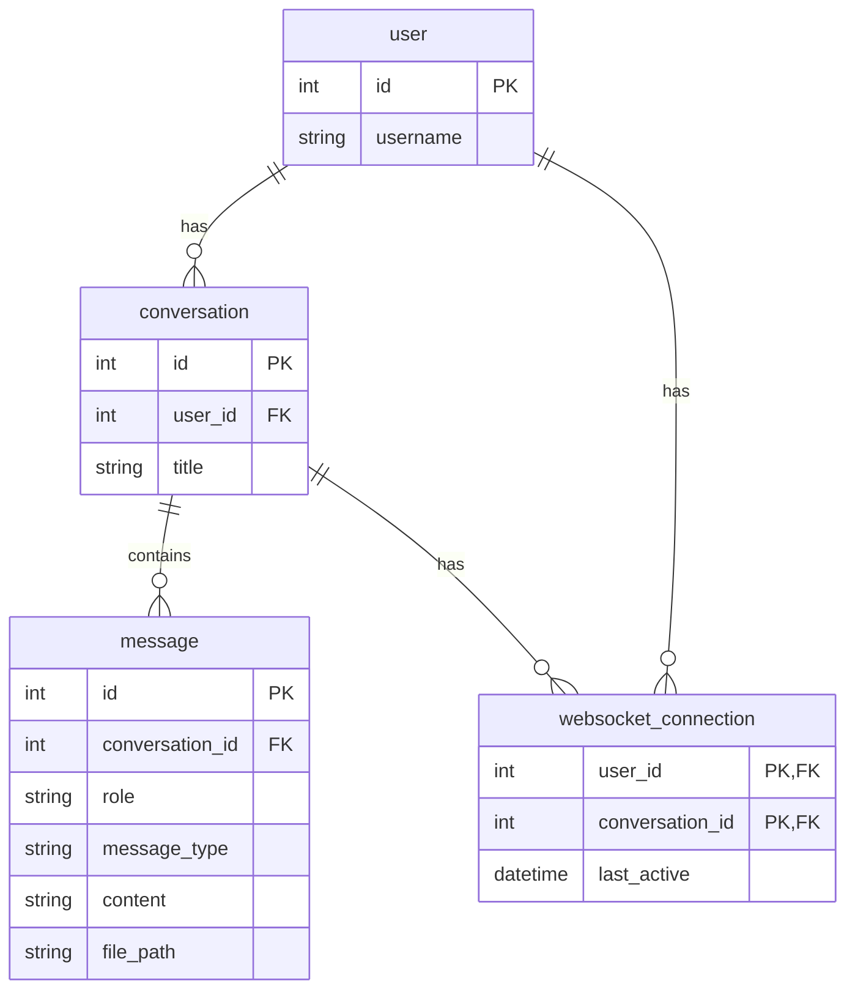

## Setting Up the Environment and Running the App

Currently, there is an issue with the presigned Minio URL in Docker. To work around this, we'll run Minio in Docker while keeping the server on the local machine.

### Steps to Set Up and Run the App

1. **Configure the Environment**
    - Set up the `.env` file based on `.env.example`.

2. **Initialize the Database**
    - Run the following command to create database tables:
      ```sh
      alembic upgrade head
      ```  
    - Alternatively, you can use `example-db.sqlite`.

3. **Set Up Minio/S3**
    - Start Minio using Docker:
      ```sh
      docker-compose up -d minio
      ```  

4. **Install Dependencies**
    - Install required dependencies:
      ```sh
      pip install -r requirements.txt
      ```  

5. **Run the Application**
    - Start the application with:
      ```sh
      uvicorn main:app --port 8000
      ``` 
6. Access the application at `http://localhost:8000`


## Database Diagram



## System Architecture
```mermaid
graph LR
    Client -- 1. WS Message --> APIServer
    APIServer -- 2. Save Media --> Minio
    APIServer -- 3. Save Message --> DB[(PostgreSQL)]
    APIServer -- 4. Send Task (message_id) --> Celery
    Celery -- 5. Process Message --> LLM
    LLM -- 6. Response --> Celery
    Celery -- 7. Save Response Message --> DB
    Celery -- 8. Save Media --> Minio
    Celery -- 9. Response message_id --> APIServer
    APIServer -- 10. Read Response --> DB
    APIServer -- 11. Get Pre-signed URL --> Minio
    APIServer -- 12. Response to Client --> Client
 ```

### API Server (FastAPI, SQLAlchemy)
- Handles client interactions via REST and WebSocket APIs.
- Receives messages, saves them to the database, and delegates processing to Celery.

### Database (PostgreSQL)
- Stores messages, user data, and metadata for retrieval.

### MinIO
- Manages storage of media files (images, audio, video).
- Provides pre-signed URL access for secure media retrieval.

### Client (Vue.js)
- Provides a user interface for chat interactions.
- Sends and receives messages via WebSockets.

### Celery
- Asynchronously processes messages.
- Calls the LLM API and stores responses in the database and MinIO.
- Notifies the API server when the response is ready.

### LLM API
- Processes messages using an AI model.
- Generates responses for the chat system.

### Workflow

1. **Client** sends a message over WebSocket.
2. **API Server** saves the message in PostgreSQL and stores media in MinIO.
3. **API Server** sends a processing task to Celery.
4. **Celery** retrieves the message, calls the LLM API, processes the response, and stores it in PostgreSQL and MinIO.
5. **Celery** notifies the API Server with the response message ID.
6. **API Server** retrieves the response, generates pre-signed URLs for media, and sends it to the client.

### Why This Tech Stack?

- **WebSocket** – Enables **real-time chat functionality** with low-latency message delivery.
- **FastAPI** – High-performance, async-ready API framework with **WebSockets, REST APIs**. Pydantic ensures **data validation and serialization**.
- **SQLAlchemy + PostgreSQL** – Ensures **efficient data storage, integrity, and retrieval** for chat messages and media metadata.
- **Celery** – Handles **background task execution** for LLM processing, media pre-processing (audio/video), and **scheduled tasks (cron jobs)**. Includes **retry mechanisms** for fault tolerance.
- **MinIO + Pre-Signed URLs** – Securely stores **user-generated media**, allowing **direct client access** while offloading bandwidth from the API server.

