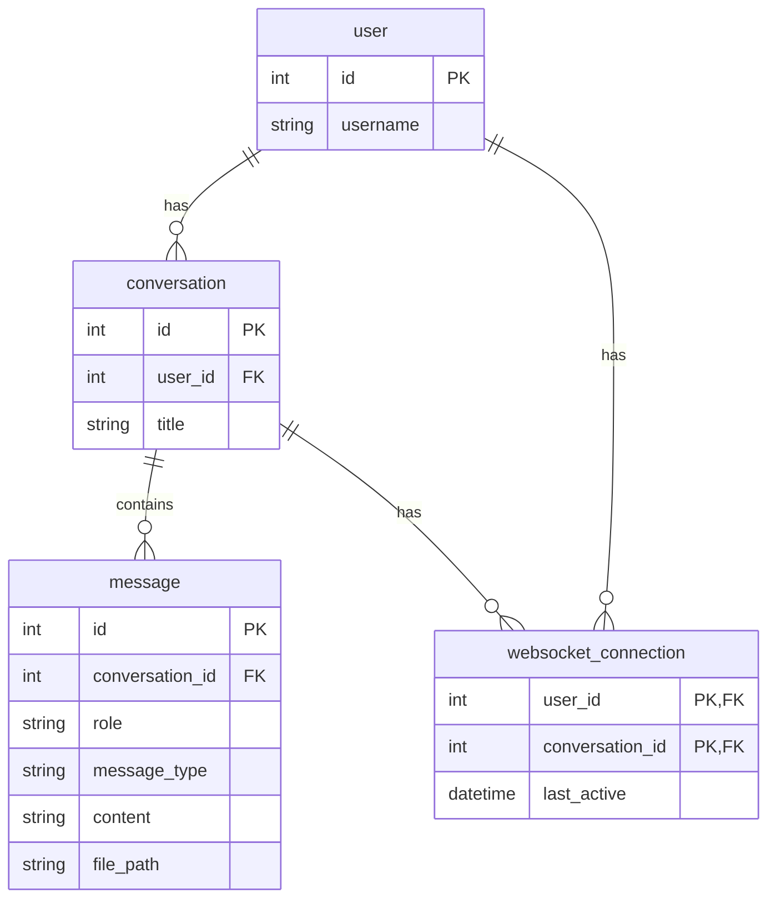

## Setting Up the Environment and Running the App

### Steps to Set Up and Run the App

1. **Configure the Environment**
    - Set up the `.env` file based on `.env.example`.

2. **Initialize the Database**
    - Run the following command to create database tables:
      ```sh
      alembic upgrade head
      ```  
    - Alternatively, you can use `example-db.sqlite`.

3. **Run the Application**
    - Start services using Docker:
      ```sh
      docker-compose up -d
      ```
4. Access the application at `http://localhost:8000`
5. Access the API documentation at `http://localhost:8000/docs`

### Run Unit Tests
- To run the tests, use:
  ```sh
  pytest
  ```

## Demo youtube video
https://www.youtube.com/watch?v=DbrUxcl_cdY


## Example End-to-End Flow - Loadtest
### Load Test Setup

The load test was conducted using **Locust**.

**Test Parameters**:
- Users: 100
- Ramp-up users: 5 users per second
- Test duration: 2 minutes
- Message types: Text, Audio, Video
- Message frequency: 1-3 seconds per client

**Results Summary**:
- Total Requests: 6,353 
- Failures: 0 
- Average Response Time: 1,537.62 ms 
- Peak Latencies:
- Text: Fastest (Avg: 553.77 ms), as expected random processing time 0 - 1000 ms
- Audio: Moderate (Avg: 1569.77 ms), as expected random processing time 1000 - 2000 ms
- Video: Slowest (Avg: 2586.65 ms), as expected random processing time 2000 - 3000 ms

Despite high throughput (56.4 requests per second), the system handled the load without failures.

|Type|Name      |Request Count|Failure Count|Median Response Time|Average Response Time|Min Response Time|Max Response Time|Average Content Size|Requests/s        |Failures/s|50%|66% |75% |80% |90% |95% |98% |99% |99.9%|99.99%|100%|
|----|----------|-------------|-------------|--------------------|---------------------|-----------------|-----------------|--------------------|------------------|----------|---|----|----|----|----|----|----|----|-----|------|----|
|WSS |audio     |2132         |0            |1600                |1569.774315391879    |1106             |2123             |62228.47889305816   |17.770330878594663|0.0       |0  |1400|1500|1700|1800|1900|2000|2000|2100 |2100  |2100|
|WSS |text      |2150         |0            |510                 |553.7712418300654    |100              |1106             |41.65953488372093   |17.920361814717882|0.0       |0  |400 |510 |610 |820 |920 |1000|1000|1000 |1100  |1100|
|WSS |timezone  |100          |0            |0                   |0.0                  |0                |0                |27.0                |0.8335052006845527|0.0       |0  |0   |0   |0   |0   |0   |0   |0   |0    |0     |0   |
|WSS |video     |1971         |0            |2600                |2586.6522633744858   |2112             |3132             |142859.99898528666  |16.428387505492534|0.0       |0  |2400|2600|2700|2800|3000|3000|3000|3100 |3100  |3100|
|    |Aggregated|6353         |0            |1500                |1537.6228239845261   |100              |3132             |65219.65103100897   |52.952585399489635|0.0       |0  |910 |1500|1800|2400|2700|2900|3000|3100 |3100  |3100|


### Run the loadtest yourself
- Update `WS_MAX_SIMULTANEOUS_USERS` in `.env` to greater than or equal to the number of users in the test

- Start Locust:
  ```sh
  locust -f load_test/locust_ws.py
  ```
- Access the Locust web interface at `http://localhost:8089` then start the test.
  

## Database Diagram



## System Architecture
```mermaid
graph LR
    Client -- 1/WS Message --> APIServer
    APIServer -- 2/Save Media --> Minio
    APIServer -- 3/Save Message --> DB[(PostgreSQL)]
    APIServer -- 4/Send Task (message_id) --> Celery
    Celery -- 5/Process Message --> LLM
    LLM -- 6/Response --> Celery
    Celery -- 7/Save Response Message --> DB
    Celery -- 8/Save Media --> Minio
    Celery -- 9/Response message_id --> APIServer
    APIServer -- 10/Read Response --> DB
    APIServer -- 11/Get Pre-signed URL --> Minio
    APIServer -- 12/Response to Client --> Client
 ```

### API Server (FastAPI, SQLAlchemy)
- Handles client interactions via REST and WebSocket APIs.
- Receives messages, saves them to the database, and delegates processing to Celery.

### Database (PostgreSQL)
- Stores messages, user data, and metadata for retrieval.

### MinIO
- Manages storage of media files (images, audio, video).
- Provides pre-signed URL access for secure media retrieval.

### Client (Vue.js)
- Provides a user interface for chat interactions.
- Sends and receives messages via WebSockets.

### Celery
- Asynchronously processes messages.
- Calls the LLM API and stores responses in the database and MinIO.
- Notifies the API server when the response is ready.

### LLM API
- Processes messages using an AI model.
- Generates responses for the chat system.

### Workflow

1. **Client** sends a message over WebSocket.
2. **API Server** saves the message in PostgreSQL and stores media in MinIO.
3. **API Server** sends a processing task to Celery.
4. **Celery** retrieves the message, calls the LLM API, processes the response, and stores it in PostgreSQL and MinIO.
5. **Celery** notifies the API Server with the response message ID.
6. **API Server** retrieves the response, generates pre-signed URLs for media, and sends it to the client.

### Why This Tech Stack?

- **WebSocket** – Enables **real-time chat functionality** with low-latency message delivery.
- **FastAPI** – High-performance, async-ready API framework with **WebSockets, REST APIs**. Pydantic ensures **data validation and serialization**.
- **SQLAlchemy + PostgreSQL** – Ensures **efficient data storage, integrity, and retrieval** for chat messages and media metadata.
- **Celery** – Handles **background task execution** for LLM processing, media pre-processing (audio/video), and **scheduled tasks (cron jobs)**. Includes **retry mechanisms** for fault tolerance.
- **MinIO + Pre-Signed URLs** – Securely stores **user-generated media**, allowing **direct client access** while offloading bandwidth from the API server.


## Implementation Plan
I will build the entire system flow, making sure all key parts—like the WebSocket API, message handling, database storage, and response processing—work correctly. However, I will not use Celery for background tasks.

Instead of running Celery, I will mock its behavior by returning predefined or simple test responses. This means the system will still process messages, but without actually using Celery to handle them in the background.

This approach allows me to focus on building and testing the core system, making sure messages are sent, received, and stored properly. It also keeps things simple and easy to run, without needing a full Celery setup.

## Constraints

### 1. At any time, a maximum of 50 clients are allowed to communicate
see `app.service.websocket_connection_service.WebsocketConnectionService`
- Check websocket_connection table for the number of concurrent user
- If accepted, create a new websocket_connection entry, else reject the connection
- Release the connection (delete) when the client disconnects

What if the server crashes in the middle of connection, the connection will not be released, and the client will not be able to connect again.

- After establishing the connection, periodically update the last_active timestamp
- Have a cron job to delete the websocket_connection entry if the last_active timestamp is older than a certain threshold
- This will ensure that the connection is released even if the server crashes

### 2. At any time, a maximum of 500 messages are processed by the server
- Celery: Use a Dedicated Queue with Limited Workers
- Example: If you have 10 workers and want to limit the number of messages to 500, set the queue limit to 50 messages per worker.
Send messages to a dedicated queue that is assigned to those workers. This way, the system can process a maximum of 500 messages at any time.

### 3. 1 client cannot make 2 connections to the server simultaneously
- Similar to the first point, check the websocket_connection table for number of active connections for the user

### 4. All clients must send at least one message to the server
- I quite don't understand this requirement. All clients must send at least one message to the server, If not what to expect?

## Scalability
- The system is designed to be scalable, with the ability to add more Celery workers to handle increased load.
- Multiple API servers can be run behind a load balancer to distribute incoming requests -> Implement sticky sessions for WebSocket connections
